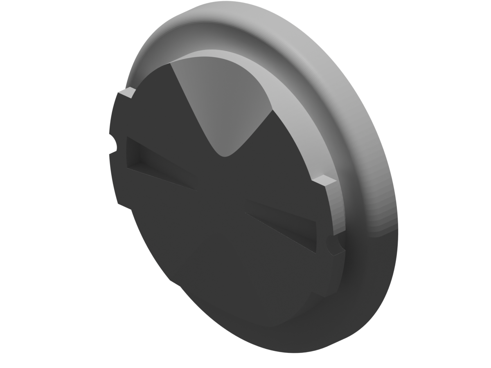
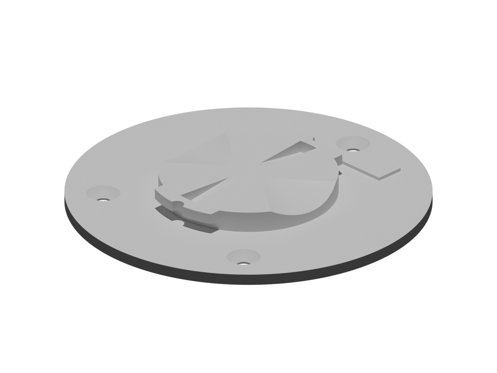

# CAD Files

This folder contains the source and printable CAD files for the Waveshare ESP32-S3 Touch AMOLED 1.75 bottom plate.

- `waveshare_amoled_175_bottom_plate.py`: Blender Python source for the plain circular bottom plate.
- `waveshare_amoled_175_bottom_board.blend`: Blender scene generated from the plain bottom plate source.
- `waveshare_amoled_175_bottom_board.stl`: Printable plain bottom plate and input for the Garmin mount generator.
- `garmin-mount.stl`: Source Garmin male mount geometry used by the Garmin bottom plate generator.
- `waveshare_amoled_175_bottom_board_garmin.py`: Blender Python source that combines the plain bottom plate with the Garmin mount locking features.
- `waveshare_amoled_175_bottom_board_garmin.stl`: Printable bottom plate with the Garmin mount, using the tested no-extra-base design and 0.5 mm tighter top connector cutouts.
- `waveshare_amoled_175_bottom_board_garmin_no_holes.stl`: Printable Garmin bottom plate variant with the three rectangular cutouts closed and screw holes retained.
- `waveshare_amoled_175_bottom_board_garmin_battery_bump.stl`: Printable Garmin bottom plate variant with the rectangular cutouts closed and a raised bump over the battery connector, so the battery can still be plugged in.
- `*.png`: Rendered previews generated from the STL files.

## Screws

- `waveshare_amoled_175_bottom_board.stl`: uses three M2x3.5 screws.
- `waveshare_amoled_175_bottom_board_garmin.stl`: uses three M2x6 screws.
- `waveshare_amoled_175_bottom_board_garmin_no_holes.stl`: uses three M2x6 screws.
- `waveshare_amoled_175_bottom_board_garmin_battery_bump.stl`: uses three M2x6 screws.

## STL Previews

| STL | Preview |
| --- | --- |
| `waveshare_amoled_175_bottom_board.stl` |  |
| `garmin-mount.stl` |  |
| `waveshare_amoled_175_bottom_board_garmin.stl` = `waveshare_amoled_175_bottom_board.stl` + `garmin-mount.stl` |  |
| `waveshare_amoled_175_bottom_board_garmin_no_holes.stl` = `waveshare_amoled_175_bottom_board_garmin.stl` with the three rectangular cutouts closed |  |
| `waveshare_amoled_175_bottom_board_garmin_battery_bump.stl` = closed-hole Garmin plate with a raised battery-plug bump |  |

Regenerate the printable files from this folder with Blender:

```sh
cd hardware/cad
blender -b --python waveshare_amoled_175_bottom_plate.py
blender -b --python waveshare_amoled_175_bottom_board_garmin.py
```
